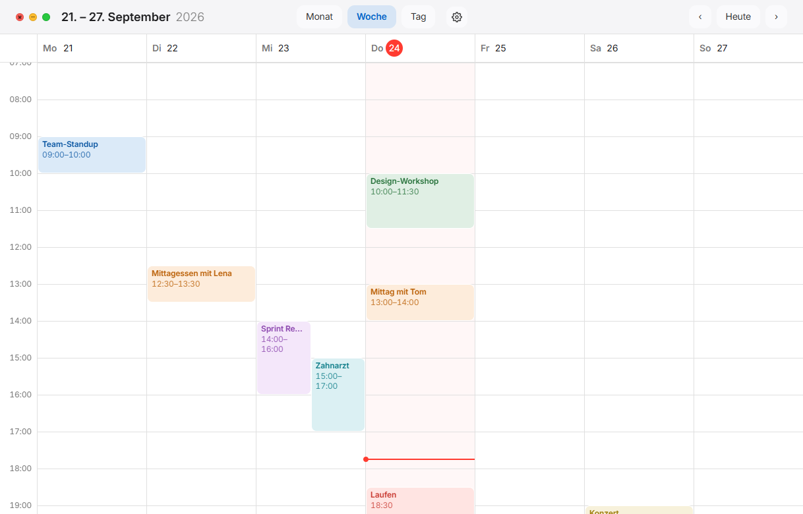
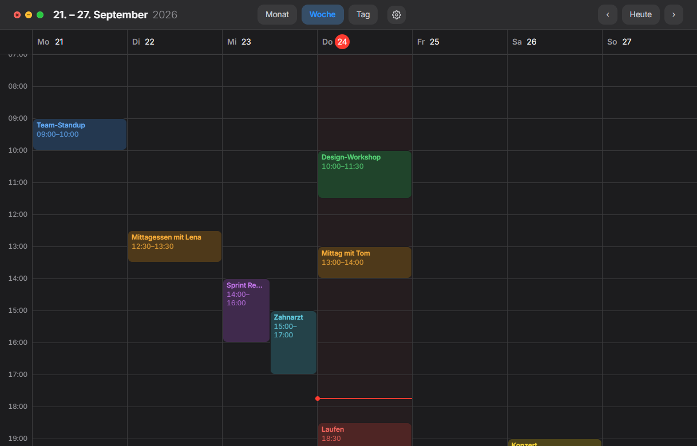
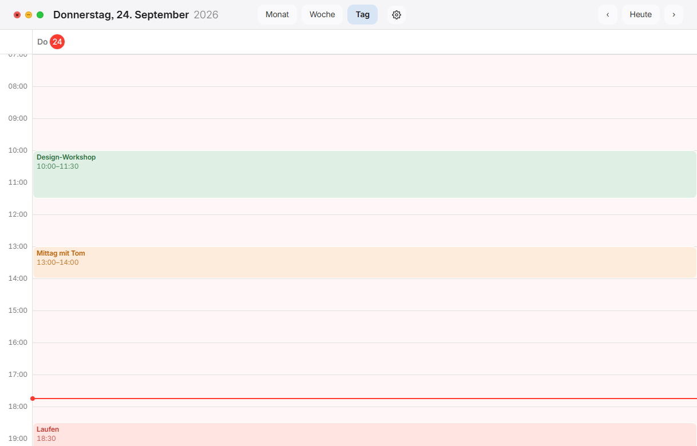
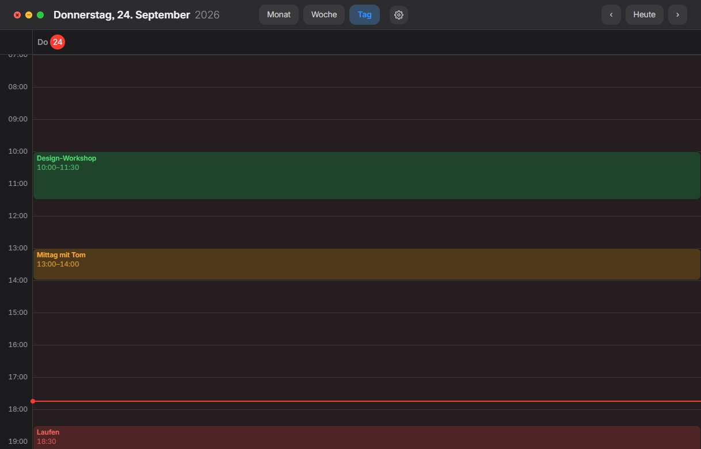
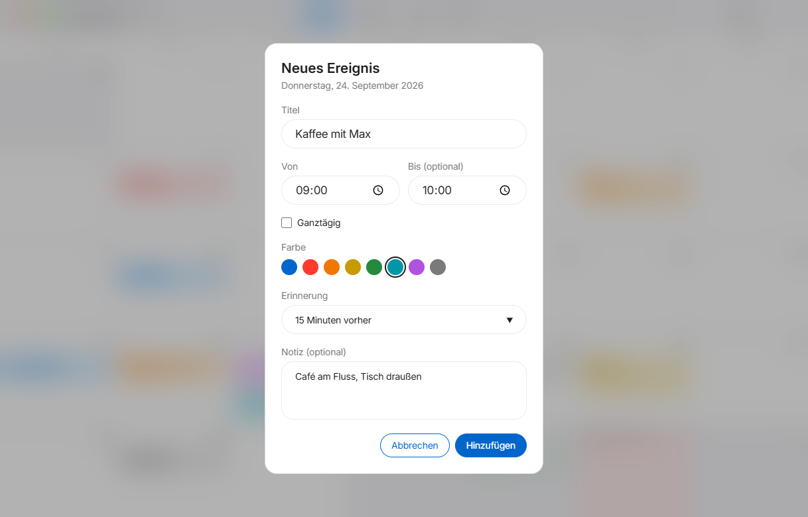
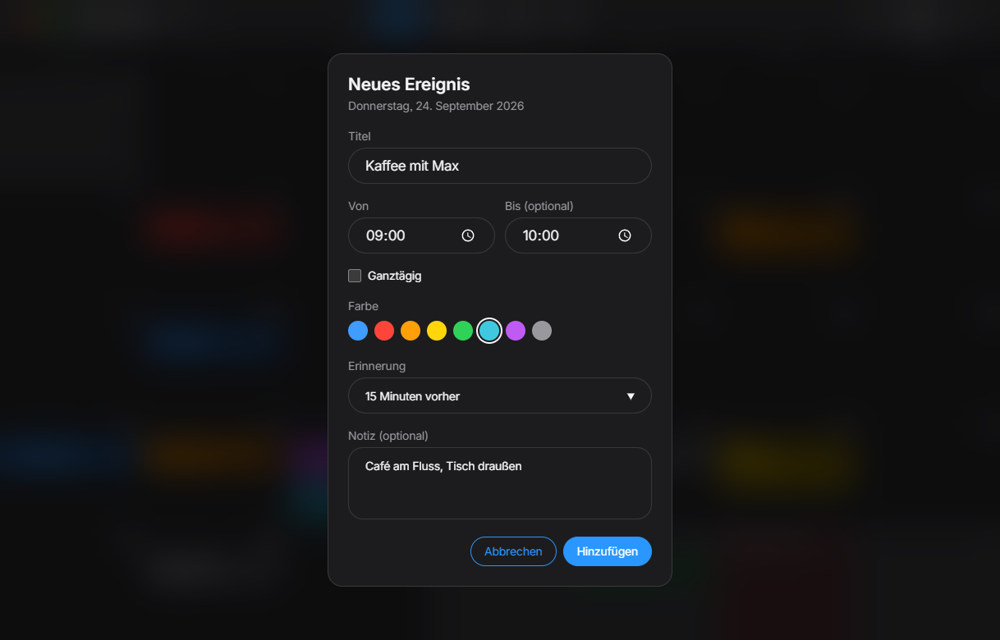

# SimpleCalendar
[](https://www.electronjs.org)
[](https://www.typescriptlang.org)
[](#tests)
[](LICENSE)

Mein persönlicher Kalender für Windows, im Mac-Look. Die Windows-Kalender-App ist bei mir einfach abgestürzt, und auf einen Kalender im Browser hatte ich keine Lust. Also eine eigene App: lebt im Tray, speichert lokal in SQLite, braucht kein Konto, keine Cloud und keine Telemetrie.

---

 
 
 
 

---
## Funktionen

- Monats-, Wochen- und Tagesansicht mit Drag & Drop
- Termine mit Endzeit, ganztägig, acht Farben, Notiz und Erinnerung per Windows-Benachrichtigung
- Deutsche Feiertage, bundesweit oder mit Bundesland
- Aktuelles Wetter über Open-Meteo, ohne API-Key
- Dark Mode nach System oder manuell
- Alle Daten liegen in einer SQLite-Datenbank unter `%APPDATA%\simplecalendar`

## Installation

```bash
npm install
npm run dist
```

Der Installer liegt danach in `dist/`. Die App startet nach der Installation automatisch mit Windows und lebt im Tray. Schließen blendet das Fenster nur aus, Beenden geht über das Tray-Menü.

> !!Der Installer ist nicht signiert, Windows SmartScreen fragt beim ersten Start nach!!

## Entwicklung

Voraussetzung: Node.js 24 oder neuer.

```bash
npm run dev              # Watch-Build, Electron startet bei Änderungen neu
npm run typecheck        # TypeScript prüfen
npm test                 # Unit- und Integrationstests
npm run test:unit        # nur Unit-Tests
npm run test:integration # nur Integrationstests: echte SQLite-Datenbank, echte Oberfläche in happy-dom
npm run test:coverage    # alle Vitest-Tests mit Coverage, Bericht unter coverage/index.html
npm run test:e2e         # End-to-End-Tests gegen die gebaute App
npm run check            # alles nacheinander
```

Nach Änderungen am Schema in `src/main/storage/schema.ts` erzeugt `npm run db:generate` eine neue Migration unter `drizzle/`, die beim nächsten Start automatisch angewendet wird.

## Lizenz

[MIT](LICENSE). Die gebündelte Schrift Inter steht unter der [SIL Open Font License](assets/fonts/LICENSE-Inter.txt).
